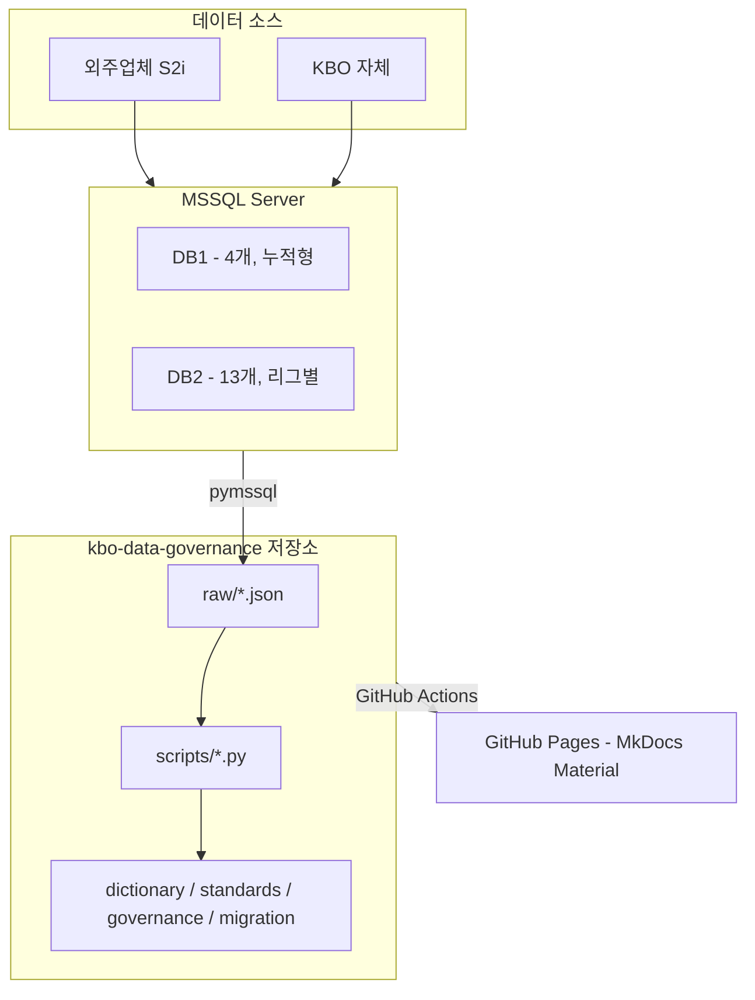

# KBO DataHub

KBO 데이터 자산의 표준, 사전, 품질, 거버넌스를 한 곳에서 관리하는 문서 포털.

39개 테이블 / 787개 컬럼 / 19개 데이터베이스 / 25.7M 행을 대상으로
AS-IS 현황 정리, 표준화 설계, 마이그레이션 매핑까지 포함한다.

---

## 배경

- 현행 시스템: MSSQL 기반, 1982년부터 축적된 경기 기록 데이터
- 신규 시스템 전환을 앞두고 현행 데이터 자산 전수 조사 및 표준화 진행

## 목적

- 39개 테이블, 787개 컬럼 **데이터 사전** 구축
- 787컬럼 AS-IS → TO-BE **컬럼 매핑** (577건 이름 변경, 210건 타입 전환)
- 명명 규칙, 도메인 타입, 코드 사전, ID 체계 등 **데이터 표준** 수립
- 오너십, 품질 규칙, 변경 관리, 보안, DR 등 **거버넌스 정책** 문서화
- 전체 산출물을 **MkDocs Material 사이트**로 배포

## 대상 독자

- **수행사** — 신규 시스템 설계 시 현행 구조, 표준, 매핑 참조
- **KBO 운영팀** — 거버넌스 정책, 데이터 품질 관리
- **데이터팀** — 데이터 사전 조회 및 유지보수

---

## 기술 스택

| 구분 | 기술 | 용도 |
|------|------|------|
| 원천 DB | Microsoft SQL Server | 19개 DB, 252개 테이블 인스턴스 |
| 문서 사이트 | MkDocs Material (Python) | 정적 사이트 생성, 한국어 검색 |
| 인터랙티브 그리드 | AG Grid Community 32.x | Catalog, Dictionary 등 그리드 뷰 |
| 자동화 스크립트 | Python 3.12+ (pymssql, openpyxl) | DB 추출, 사전 생성, Excel 산출물 |
| 인증 | 클라이언트 SHA-256 해시 | 사이트 접근 제어 (서버 불필요) |
| CI/CD | GitHub Actions | main push 시 GitHub Pages 자동 배포 |

---

## 시스템 아키텍처



- **DB1** — 누적형 영구 DB. 1군/2군 정규시즌 데이터가 연도별로 쌓임
- **DB2** — 리그별 시즌 DB. 포스트시즌, 올스타, 시범경기, 국제대회 등 별도 DB
- 동일 테이블 구조가 최대 12개 DB에 인스턴스로 존재 (총 248개 인스턴스)
- 스키마 세대가 혼재: **구세대**(GMKEY/PCODE)와 **신세대**(G_ID/P_ID) 공존

상세는 [architecture.md](architecture.md) 참조.

---

## 디렉토리 구조

```
kbo-data-governance/
│
├── README.md                    ← 이 파일
├── home.md                      ← MkDocs 홈 페이지 (사이트 대시보드)
├── project-guide.md             ← 수행사/운영팀 가이드, 레거시 주의사항, 미결 사항
├── architecture.md              ← 시스템 아키텍처 상세
├── development-guide.md         ← 유지보수 절차, 트러블슈팅
├── mkdocs.yml                   ← MkDocs 설정
├── serve.sh                     ← 로컬 서버 실행
│
├── dictionary/                  # 데이터 사전 — 39개 테이블, 테이블당 1파일
│   ├── index.md                 #   도메인별 요약
│   ├── lineage.md               #   데이터 리니지
│   ├── products/                #   데이터 프로덕트 6종
│   ├── game/                    #   경기 기록 (12테이블)
│   ├── stats/                   #   통계 (10테이블)
│   ├── realtime/                #   실시간 (9테이블)
│   └── master/                  #   마스터 (8테이블)
│
├── catalog/                     # AG Grid 카탈로그
│   ├── instances.md             #   248 인스턴스 매트릭스
│   └── columns.md               #   787 컬럼 검색
│
├── standards-dict/              # 4대 사전 (AG Grid)
│   ├── glossary.md              #   용어 134건
│   ├── abbreviations.md         #   약어
│   ├── domains.md               #   도메인 타입 93건
│   └── codes.md                 #   코드 168건
│
├── standards/                   # 데이터 표준
│   ├── naming-rules.md          #   4계층 명명 규칙
│   └── id-system.md             #   6종 식별자 체계
│
├── governance/                  # 거버넌스 정책 6종
│   ├── data-ownership.md        #   RBAC 권한 매트릭스
│   ├── quality-rules.md         #   품질 KPI, SLA
│   ├── change-process.md        #   변경 관리 절차
│   ├── table-design-guide.md    #   테이블 설계 가이드
│   ├── data-security.md         #   보안 분류, PII
│   └── disaster-recovery.md     #   RTO/RPO, DR
│
├── migration/                   # 마이그레이션
│   ├── column-mapping.md        #   787컬럼 AS-IS→TO-BE 매핑
│   ├── table-mapping.md         #   19DB 테이블 매핑
│   ├── design-decisions.md      #   타입 전환 설계 결정
│   └── column-diff.md           #   스키마 차이 분석
│
├── glossary/business-terms.md   # 업무 용어 원본
│
├── assets/                      # CSS, JS, JSON, 이미지
│   ├── css/                     #   스타일시트 7종
│   ├── js/                      #   JavaScript 10종
│   ├── data/                    #   AG Grid JSON (빌드 생성물)
│   └── images/                  #   로고
│
├── scripts/                     # Python 자동화 13종
├── raw/                         # 기계 추출 원본 (수정 금지)
├── references/                  # 원본 참고 자료 (수정 금지)
└── exports/                     # Excel 산출물
```

---

## 빠른 시작

```bash
git clone git@github.com:kbop-platform/kbo-data-governance.git
cd kbo-data-governance
pip install mkdocs-material
bash serve.sh
# http://127.0.0.1:8000
```

DB 스크립트 실행이 필요한 경우 [development-guide.md](development-guide.md) 참조.

---

## 주요 문서 안내

### 수행사 개발자

| 순서 | 문서 | 내용 |
|:---:|------|------|
| 1 | [데이터 프로덕트](dictionary/products/game-summary.md) | 비즈니스 단위별 데이터 구조 |
| 2 | [명명 규칙](standards/naming-rules.md) | DB/API/Kafka/WS 4계층 네이밍 |
| 3 | [ID 체계](standards/id-system.md) | 식별자 6종, 복합 PK 표준 |
| 4 | [도메인 사전](standards-dict/domains.md) | 도메인 타입, 인코딩 정책 |
| 5 | [코드 사전](standards-dict/codes.md) | 코드값 전체 정의 |
| 6 | [컬럼 매핑](migration/column-mapping.md) | 787컬럼 AS-IS → TO-BE 매핑 |
| 7 | [프로젝트 가이드](project-guide.md) | 레거시 주의사항, 미결 사항 포함 |

### KBO 운영팀

[governance/data-ownership.md](governance/data-ownership.md) →
[governance/quality-rules.md](governance/quality-rules.md) →
[governance/change-process.md](governance/change-process.md) →
[governance/data-security.md](governance/data-security.md) →
[governance/disaster-recovery.md](governance/disaster-recovery.md)

### 유지보수 담당

| 문서 | 내용 |
|------|------|
| [architecture.md](architecture.md) | 시스템 구성, DB 구조, 데이터 흐름 |
| [development-guide.md](development-guide.md) | 테이블 추가/수정 절차, 트러블슈팅 |

---

## 데이터 도메인

| 도메인 | 테이블 | 컬럼 | 주요 테이블 |
|--------|:------:|:----:|------------|
| 경기 기록 | 12 | 284 | GAMEINFO, Hitter, Pitcher, Score |
| 통계 | 10 | 318 | BatTotal, PitTotal, SEASON_PLAYER_HITTER |
| 실시간 | 9 | 96 | IE_LiveText, IE_BallCount, IE_GAMESTATE |
| 마스터 | 8 | 95 | person, TEAM, STADIUM, KBO_schedule |

**티어**: Tier 1 Critical (12개) / Tier 2 Standard (17개) / Tier 3 Reference (10개)

---

## 기여 규칙

- `main` 직접 push 금지. PR 필수.
- 커밋: `docs: GAMEINFO 컬럼 설명 보완` / `data: 2026시즌 데이터 갱신`
- 사전 수정 후 `python scripts/build-grid-data.py` 실행하여 JSON 동기화

상세 절차는 [development-guide.md](development-guide.md) 참조.

---

(c) 2026 KBOP Data Biz Team. Confidential.
