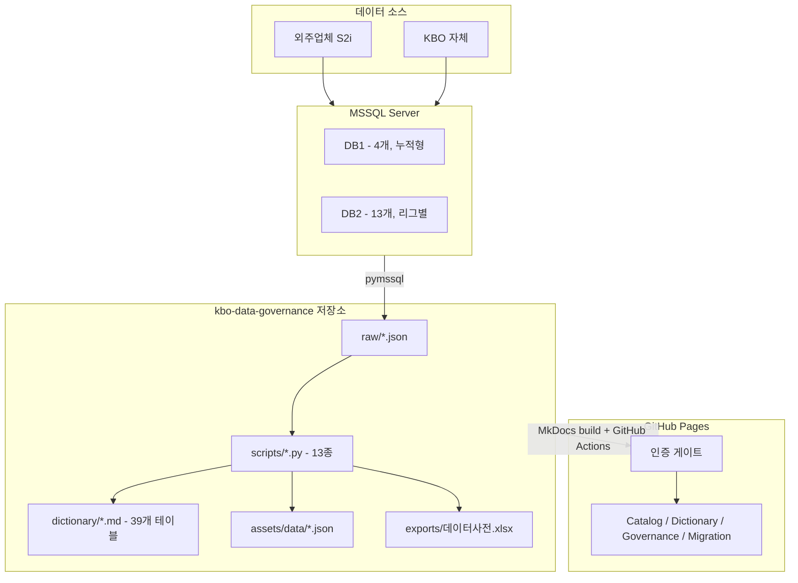
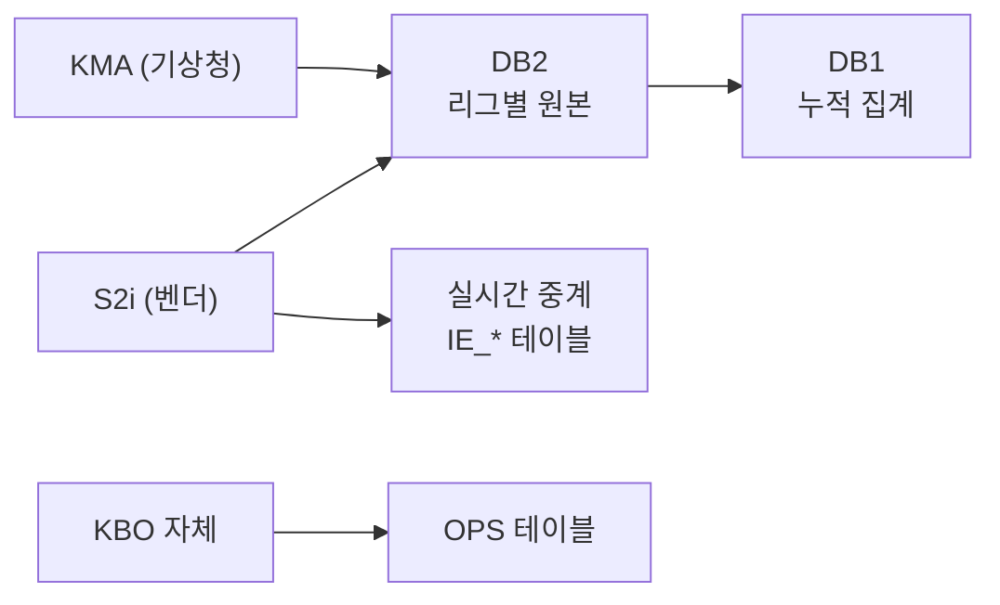
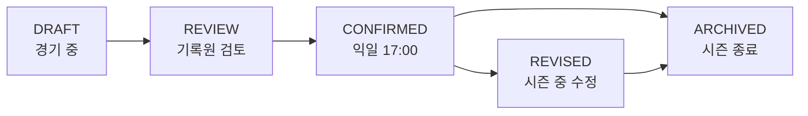

# 시스템 아키텍처

KBO DataHub의 시스템 구성, DB 구조, 데이터 흐름을 기술한다.

---

## 전체 구성



---

## 데이터베이스 구조

### DB1 (누적형, 4개)

| DB명 | 대상 | 비고 |
|------|------|------|
| DB1_BASEBALL_220328 | 1군 정규시즌 | 13테이블, 5.2M행 |
| DB1_BASEBALL_2_220328 | 1군 정규시즌 (확장) | 4테이블, 695K행. 신세대 스키마 |
| DB1_MINOR_BASEBALL_220328 | 2군 정규시즌 | 9테이블, 1.7M행 |
| DB1_MINOR_SO_BASEBALL | 소셜 야구 | 9테이블, 26K행 |

연도별 데이터가 같은 DB에 누적됨 (`GYEAR` 컬럼으로 구분).

### DB2 (리그별 시즌형, 13개)

| DB명 | 대상 |
|------|------|
| DB2_BASEBALL_220328 | 1군 시즌 (구세대) |
| DB2_BASEBALL_2_220328 | 1군 시즌 (확장) |
| DB2_BASEBALL_NEW_220328 | 1군 시즌 (신세대) |
| DB2_POSTSEASON | 포스트시즌 |
| DB2_ALLSTAR | 올스타전 |
| DB2_EXHIBITION | 시범경기 |
| DB2_INTERNATIONAL | 국제대회 |
| DB2_OTHER_GAME | 기타 경기 |
| DB2_MINOR_* (4개) | 마이너 리그 |
| BROADCAST_BASEBALL | 방송 데이터 |
| FALL_LEAGUE_BASEBALL | 가을야구 |

동일 테이블 구조가 리그별로 복제됨. 예: `Hitter` 테이블이 12개 DB에 존재.
전체 252개 인스턴스 중 39개 고유 테이블 구조.

---

## 스키마 세대

현행 시스템에 두 세대의 스키마가 공존한다.

| 구분 | 구세대 (legacy) | 신세대 (new) |
|------|----------------|-------------|
| PK 식별자 | GMKEY (char 15), PCODE (varchar) | G_ID (char 13), P_ID (int) |
| 명명 스타일 | PascalCase, 약어 (HRA, KK, HP) | lower_snake_case + suffix (_id, _cd, _nm) |
| 도입 시기 | 1982년~ | 2020년대~ |
| 대표 테이블 | GAMEINFO, Hitter, Pitcher | SEASON_PLAYER_HITTER, SEASON_PLAYER_PITCHER |
| 해당 DB | DB1_BASEBALL, DB2_BASEBALL 등 | DB1_BASEBALL_2, DB2_BASEBALL_NEW 등 |

`realtime/` 도메인의 IE_* 테이블은 세대 미분류(`unknown`).

표준화 방향: 모든 컬럼을 `lower_snake_case` + 도메인 suffix로 통일.
전체 매핑은 [migration/column-mapping.md](migration/column-mapping.md) 참조.

---

## 데이터 흐름



### 데이터 생명주기



### 갱신 주기별 테이블

| 주기 | 테이블 수 | 예시 |
|------|:---------:|------|
| 실시간 | 9 | IE_LiveText, IE_BallCount |
| 경기당일 | 12 | GAMEINFO, Hitter, Pitcher, Score |
| D+1 | 5 | BatTotal, PitTotal, TeamRank |
| 시즌 | 4 | SEASON_PLAYER_HITTER |
| 연 1회 | 9 | person, TEAM, STADIUM |

---

## 빌드 및 배포

### 심볼릭 링크 구조

MkDocs는 `docs/`를 소스로 사용한다. `serve.sh`가 심볼릭 링크를 생성하여
루트의 콘텐츠 디렉토리를 `docs/`에 연결한다.

```
docs/ (gitignored)
├── index.md        → ../home.md
├── dictionary/     → ../dictionary/
├── catalog/        → ../catalog/
├── standards/      → ../standards/
├── standards-dict/ → ../standards-dict/
├── governance/     → ../governance/
├── migration/      → ../migration/
├── glossary/       → ../glossary/
└── assets/         → ../assets/
```

새 디렉토리를 추가할 때는 `serve.sh`와 `.github/workflows/deploy-docs.yml` 양쪽에
심볼릭 링크를 추가해야 한다.

### GitHub Actions

`main` push 시 `.github/workflows/deploy-docs.yml`이 자동 실행:
심볼릭 링크 생성 → `mkdocs build` → GitHub Pages 배포.

---

## 데이터 프로덕트

6개 프로덕트가 비즈니스 단위로 테이블을 그룹핑한다.

| 프로덕트 | 테이블 | 컬럼 | 갱신 주기 |
|----------|:------:|:----:|----------|
| 경기 요약 | 8 | 216 | 경기당일 |
| 실시간 경기 | 9 | 96 | 실시간 |
| 선수 프로필 | 4 | 43 | 연 1회 |
| 시즌 통계 | 6 | 274 | D+1~시즌 |
| 일정 관리 | 2 | 22 | 시즌 |
| 기준 데이터 | 3 | 21 | 연 1회 |

각 프로덕트 상세는 `dictionary/products/` 참조.

---

## 인증

클라이언트 사이드 SHA-256 해시 인증. 서버 불필요.

- `auth.js`가 페이지 로드 시 콘텐츠를 숨김
- `아이디:비밀번호` 입력 → SHA-256 해시 비교
- `sessionStorage`에 저장, 탭 닫으면 만료
- 인증 해시 변경: `assets/js/auth.js`의 `HASH` 상수 수정

정적 사이트 간이 접근 제어 용도. 보안이 중요한 경우 서버 사이드 인증으로 대체 필요.

---

## 티어 및 역할

| 티어 | 테이블 수 | 기준 |
|------|:---------:|------|
| Tier 1 (Critical) | 12 | 서비스 핵심. 유실 시 장애 |
| Tier 2 (Standard) | 17 | 일상 운영. 지연 시 영향 |
| Tier 3 (Reference) | 10 | 참조용. 지연 허용 |

| 역할 | 주요 책임 |
|------|----------|
| S2i (벤더) | 경기 데이터 수집, DB2 적재 |
| KBO 기록위원회 | 데이터 검증, 확정 |
| KBO 운영팀 | 마스터 데이터 관리 |
| 통계분석팀 | 시즌 통계, 세이버메트릭스 |
| 외부 수행사 | 시스템 개발, 읽기 전용 |
| 데이터팀 | 표준 관리, 품질 모니터링 |

상세 권한 매트릭스는 [governance/data-ownership.md](governance/data-ownership.md) 참조.
