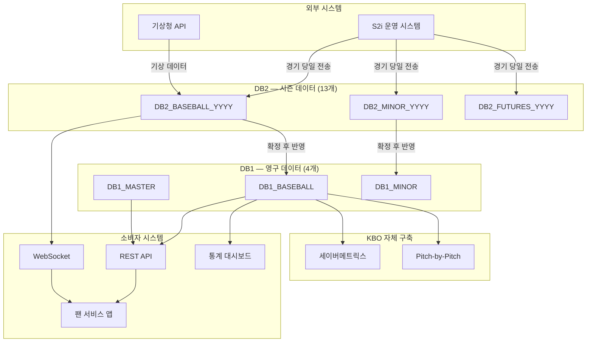
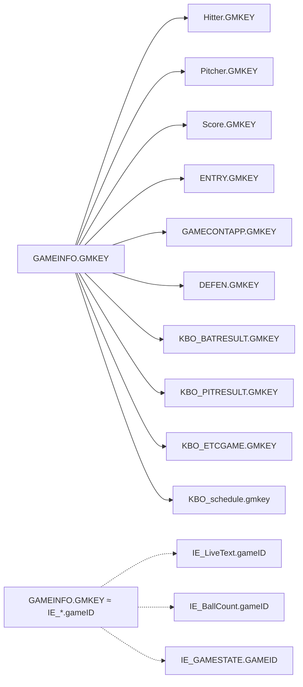
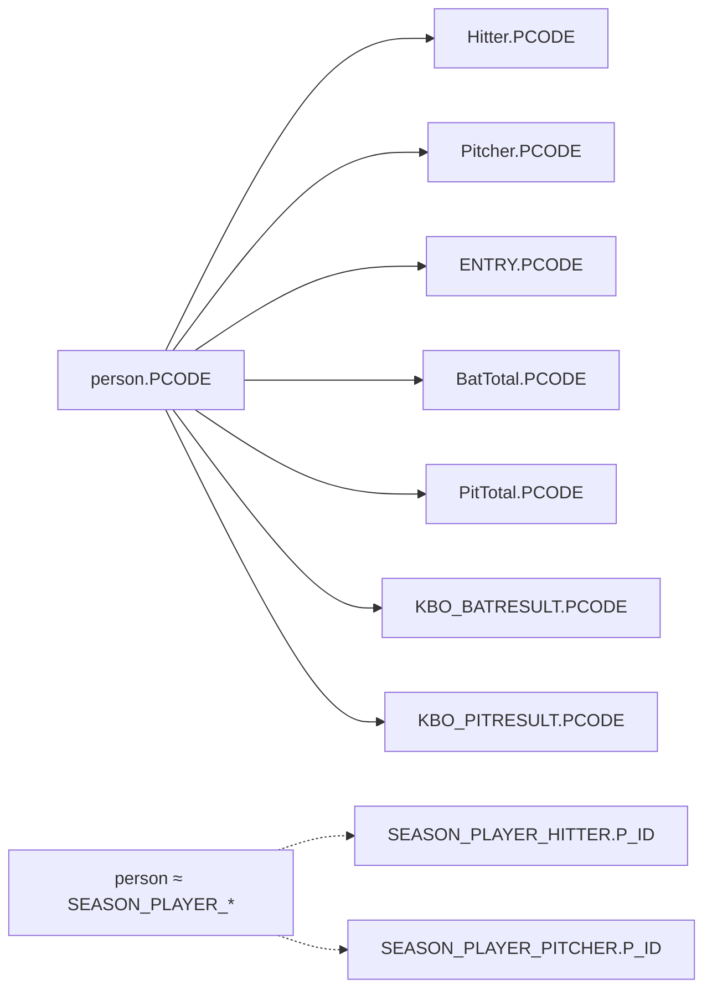
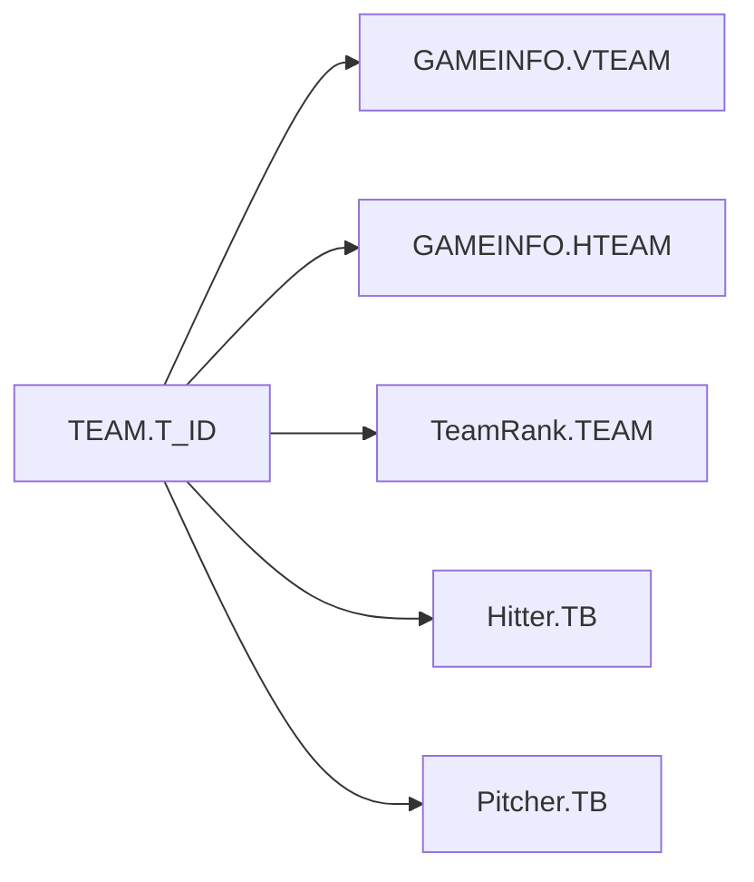

# 데이터 리니지 (Data Lineage)

> 최종수정: 2026-02-25 | 데이터 흐름 추적 문서

## 1. 시스템 레벨 리니지

데이터가 시스템 간 어떻게 흐르는지를 나타낸다.

---

## 2. 테이블 레벨 리니지

### 2.1 경기 기록 도메인 (game/)

각 테이블의 소스 → 처리 → 소비 경로를 정리한다.

| 테이블 | 소스 | 갱신 시점 | 저장소 | 소비자 |
|--------|------|----------|--------|--------|
| GAMEINFO | S2i 운영 시스템 | 경기 당일 | DB2 → DB1 | 방송팀, 기록팀, API |
| Hitter | S2i 운영 시스템 | 경기 당일 | DB2 → DB1 | 기록팀, 통계팀 |
| Pitcher | S2i 운영 시스템 | 경기 당일 | DB2 → DB1 | 기록팀, 통계팀 |
| Score | S2i 운영 시스템 | 경기 당일 | DB2 → DB1 | 방송팀, API |
| ENTRY | S2i 운영 시스템 | 경기 당일 | DB2 → DB1 | 기록팀 |
| GAMECONTAPP | S2i 운영 시스템 | 경기 당일 | DB2 → DB1 | 기록팀, 분석팀 |
| DEFEN | S2i 운영 시스템 | 경기 당일 | DB2 → DB1 | 기록팀 |
| GAME_HR | S2i 운영 시스템 | 경기 당일 | DB2 → DB1 | 미디어, API |
| GAME_MEMO | S2i 운영 시스템 | 경기 당일 | DB2 → DB1 | 기록팀 |
| GAME_MEMO_PITCHCLOCK | S2i 운영 시스템 | 경기 당일 | DB2 → DB1 | 기록팀 |
| PITCHCLOCK | S2i 운영 시스템 | 경기 당일 | DB2 → DB1 | 기록팀 |
| GAMEINFO_WEATHER | 기상청 API | 경기 당일 | DB2 | 방송팀 |

→ 참고: [경기 기록 사전](game/README.md) — 테이블별 컬럼 상세

### 2.2 통계 도메인 (stats/)

| 테이블 | 소스 | 갱신 시점 | 저장소 | 소비자 |
|--------|------|----------|--------|--------|
| BatTotal | 경기 기록 집계 | D+1 | DB1 | 통계팀, API |
| PitTotal | 경기 기록 집계 | D+1 | DB1 | 통계팀, API |
| TeamRank | 경기 결과 집계 | D+1 | DB1 | 미디어, API |
| KBO_BATRESULT | 경기별 이닝 집계 | 경기 당일 | DB2 → DB1 | 분석팀 |
| KBO_PITRESULT | 경기별 투수 집계 | 경기 당일 | DB2 → DB1 | 분석팀 |
| KBO_ETCGAME | 기타 이벤트 | 경기 당일 | DB2 → DB1 | 기록팀 |
| SEASON_PLAYER_HITTER | 시즌 집계 | D+1 | DB2 | 통계팀, API |
| SEASON_PLAYER_HITTER_SITUATION | 시즌 상황별 집계 | D+1 | DB2 | 분석팀 |
| SEASON_PLAYER_PITCHER | 시즌 집계 | D+1 | DB2 | 통계팀, API |
| SEASON_PLAYER_PITCHER_SITUATION | 시즌 상황별 집계 | D+1 | DB2 | 분석팀 |

→ 참고: [통계 사전](stats/README.md) — 테이블별 컬럼 상세

### 2.3 실시간 도메인 (realtime/)

| 테이블 | 소스 | 갱신 시점 | 저장소 | 소비자 |
|--------|------|----------|--------|--------|
| IE_LiveText | S2i 실시간 전송 | 실시간 (<5초) | DB2 | 방송팀, 앱, WebSocket |
| IE_BallCount | S2i 실시간 전송 | 실시간 (<5초) | DB2 | 방송팀, 앱, WebSocket |
| IE_BatterRecord | S2i 실시간 전송 | 실시간 (<5초) | DB2 | 방송팀, 앱, WebSocket |
| IE_PitcherRecord | S2i 실시간 전송 | 실시간 (<5초) | DB2 | 방송팀, 앱, WebSocket |
| IE_GAMESTATE | S2i 실시간 전송 | 실시간 (<5초) | DB2 | 방송팀, 앱, WebSocket |
| IE_MatchPlayer | S2i 실시간 전송 | 실시간 (<5초) | DB2 | 방송팀, 앱, WebSocket |
| IE_Lineup | S2i 실시간 전송 | 실시간 (<5초) | DB2 | 방송팀, 앱, WebSocket |
| IE_BatOrder | S2i 실시간 전송 | 실시간 (<5초) | DB2 | 방송팀, 앱, WebSocket |
| IE_log | 시스템 자동 생성 | 실시간 | DB2 | 운영팀 |

→ 참고: [실시간 사전](realtime/README.md) — 테이블별 컬럼 상세

### 2.4 마스터 도메인 (master/)

| 테이블 | 소스 | 갱신 시점 | 저장소 | 소비자 |
|--------|------|----------|--------|--------|
| person | KBO 기록팀 | 시즌 전 | DB1 | 전 시스템 |
| person2 | KBO 기록팀 | 시즌 전 | DB1 | 전 시스템 |
| PERSON | KBO 기록팀 | 시즌 전 | DB1 | 전 시스템 |
| PERSON_FA | KBO 기록팀 | FA 발생 시 | DB1 | 기록팀, 인사팀 |
| TEAM | KBO 사무국 | 연 1회 | DB1 | 전 시스템 |
| STADIUM | KBO 사무국 | 연 1회 | DB1 | 전 시스템 |
| KBO_schedule | KBO 경기운영팀 | 시즌 전 일괄 | DB1 | 전 시스템 |
| CANCEL_GAME | KBO 경기운영팀 | 발생 즉시 | DB2 | 운영팀, 방송팀 |

→ 참고: [마스터 사전](master/README.md) — 테이블별 컬럼 상세

---

## 3. 컬럼 레벨 리니지 -- 핵심 식별자

핵심 ID가 테이블 간 어떻게 참조되는지를 추적한다.

→ 참고: [ID 체계](../standards/id-system.md) — 6종 핵심 ID 정의

### 3.1 game_id (현행: GMKEY)

### 3.2 player_id (현행: PCODE)

### 3.3 team_id (현행: TEAM.T_ID / VTEAM, HTEAM)

---

## 4. 데이터 생명주기

| 단계 | 설명 | 상태 |
|------|------|------|
| 1. 수집 | S2i에서 경기 당일 DB2로 전송 | DRAFT |
| 2. 검증 | 기록위원회 검토 (무결성, 정합성 확인) | REVIEW |
| 3. 확정 | 공식 기록으로 확정, DB1 반영 | CONFIRMED |
| 4. 수정 | 확정 후 오류 발견 시 수정 | REVISED |
| 5. 보존 | 영구 보존 (삭제 불가) | ARCHIVED |

→ 참고: [변경 관리 절차](../governance/change-process.md) — 상태 전환 절차
→ 참고: [코드 사전](../standards/code-dictionary.md) — record_status_cd 정의

---

## 5. 영향도 분석 매트릭스

특정 테이블 변경 시 영향을 받는 다른 테이블과 시스템을 정리한다.

| 변경 테이블 | 영향받는 테이블 | 영향받는 시스템 | 영향도 |
|------------|---------------|---------------|--------|
| GAMEINFO | Hitter, Pitcher, Score, ENTRY, GAMECONTAPP, DEFEN, IE_* | 방송, API, 통계 | Critical |
| person | Hitter, Pitcher, ENTRY, BatTotal, PitTotal, SEASON_PLAYER_* | 전 시스템 | Critical |
| TEAM | GAMEINFO, TeamRank | 전 시스템 | High |
| STADIUM | GAMEINFO, KBO_schedule | 운영, 방송 | Medium |
| BatTotal | (소비 전용) | 통계, API | Low |
