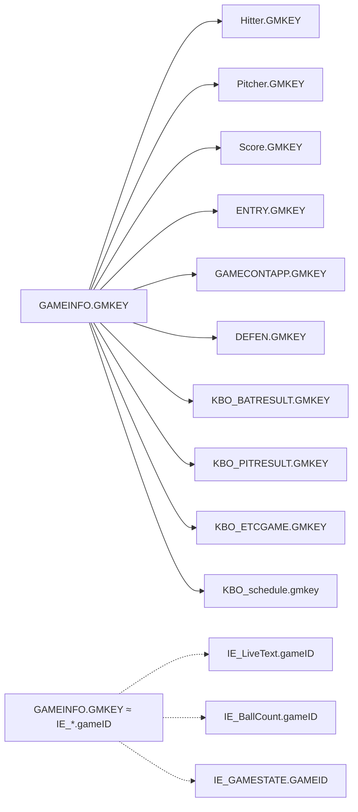
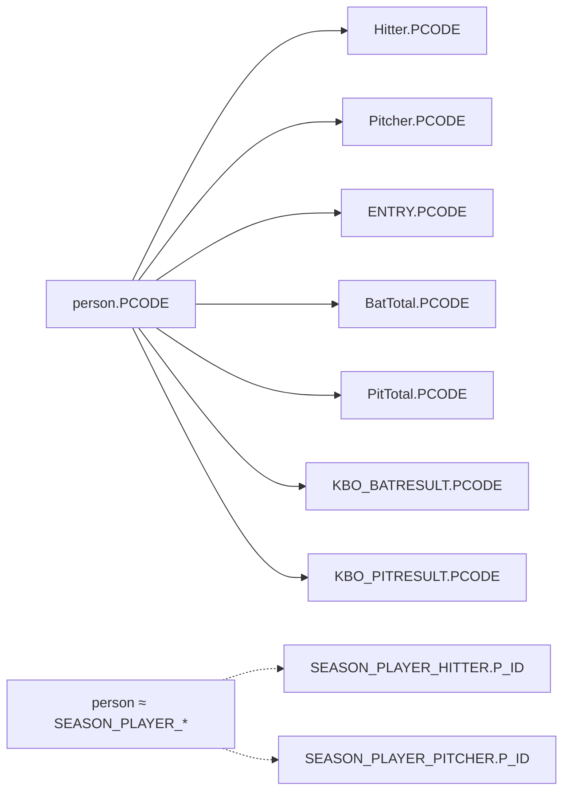
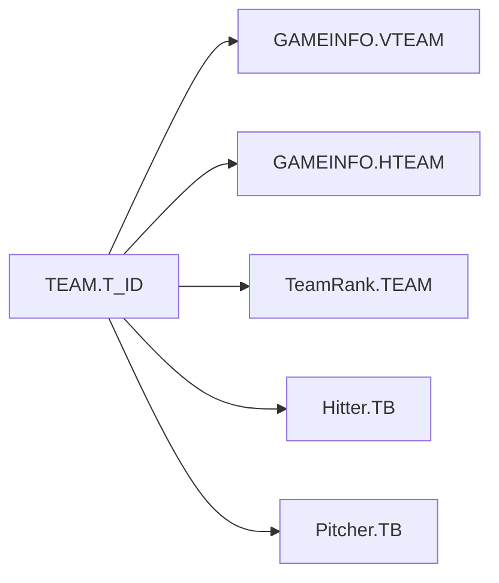

---
hide:
  - toc
---

  

    거버넌스
    39 테이블
    4 도메인
  

  
데이터 리니지

  
Data Lineage

  
소스 시스템에서 소비자 시스템까지, 데이터가 어디서 오고 어디로 가는지를 시스템·테이블·컬럼 3단계로 추적한다.

  

3

소스 시스템

  

DB1 + DB2

저장소

  

5단계

생명주기

  

6종

핵심 ID

<!-- ══════════════════════════════════════════ -->
<!-- 1. 시스템 레벨 리니지                       -->
<!-- ══════════════════════════════════════════ -->

  
<h2>1. 시스템 레벨 리니지</h2>

  
데이터가 시스템 간 어떻게 흐르는지를 나타낸다.

  

  

<!-- ══════════════════════════════════════════ -->
<!-- 2. 테이블 레벨 리니지                       -->
<!-- ══════════════════════════════════════════ -->

  
<h2>2. 테이블 레벨 리니지</h2>

  

    <h2 style="font-size:15px">2.1 경기 기록</h2>
    12개
  

  <table class="product-table">
    <thead><tr><th>테이블</th><th>소스</th><th>갱신</th><th>저장소</th><th>소비자</th></tr></thead>
    <tbody>
      <tr><td><a href="game/GAMEINFO/">GAMEINFO</a></td><td>S2i</td><td>경기 당일</td><td>DB2 → DB1</td><td>방송팀, 기록팀, API</td></tr>
      <tr><td><a href="game/Hitter/">Hitter</a></td><td>S2i</td><td>경기 당일</td><td>DB2 → DB1</td><td>기록팀, 통계팀</td></tr>
      <tr><td><a href="game/Pitcher/">Pitcher</a></td><td>S2i</td><td>경기 당일</td><td>DB2 → DB1</td><td>기록팀, 통계팀</td></tr>
      <tr><td><a href="game/Score/">Score</a></td><td>S2i</td><td>경기 당일</td><td>DB2 → DB1</td><td>방송팀, API</td></tr>
      <tr><td><a href="game/ENTRY/">ENTRY</a></td><td>S2i</td><td>경기 당일</td><td>DB2 → DB1</td><td>기록팀</td></tr>
      <tr><td><a href="game/GAMECONTAPP/">GAMECONTAPP</a></td><td>S2i</td><td>경기 당일</td><td>DB2 → DB1</td><td>기록팀, 분석팀</td></tr>
      <tr><td><a href="game/DEFEN/">DEFEN</a></td><td>S2i</td><td>경기 당일</td><td>DB2 → DB1</td><td>기록팀</td></tr>
      <tr><td><a href="game/GAME_HR/">GAME_HR</a></td><td>S2i</td><td>경기 당일</td><td>DB2 → DB1</td><td>미디어, API</td></tr>
      <tr><td><a href="game/GAME_MEMO/">GAME_MEMO</a></td><td>S2i</td><td>경기 당일</td><td>DB2 → DB1</td><td>기록팀</td></tr>
      <tr><td><a href="game/GAME_MEMO_PITCHCLOCK/">GAME_MEMO_PITCHCLOCK</a></td><td>S2i</td><td>경기 당일</td><td>DB2 → DB1</td><td>기록팀</td></tr>
      <tr><td><a href="game/PITCHCLOCK/">PITCHCLOCK</a></td><td>S2i</td><td>경기 당일</td><td>DB2 → DB1</td><td>기록팀</td></tr>
      <tr><td><a href="game/GAMEINFO_WEATHER/">GAMEINFO_WEATHER</a></td><td>기상청 API</td><td>경기 당일</td><td>DB2</td><td>방송팀</td></tr>
    </tbody>
  </table>

  

    <h2 style="font-size:15px">2.2 통계</h2>
    10개
  

  <table class="product-table">
    <thead><tr><th>테이블</th><th>소스</th><th>갱신</th><th>저장소</th><th>소비자</th></tr></thead>
    <tbody>
      <tr><td><a href="stats/BatTotal/">BatTotal</a></td><td>경기 기록 집계</td><td>D+1</td><td>DB1</td><td>통계팀, API</td></tr>
      <tr><td><a href="stats/PitTotal/">PitTotal</a></td><td>경기 기록 집계</td><td>D+1</td><td>DB1</td><td>통계팀, API</td></tr>
      <tr><td><a href="stats/TeamRank/">TeamRank</a></td><td>경기 결과 집계</td><td>D+1</td><td>DB1</td><td>미디어, API</td></tr>
      <tr><td><a href="stats/KBO_BATRESULT/">KBO_BATRESULT</a></td><td>경기별 이닝 집계</td><td>경기 당일</td><td>DB2 → DB1</td><td>분석팀</td></tr>
      <tr><td><a href="stats/KBO_PITRESULT/">KBO_PITRESULT</a></td><td>경기별 투수 집계</td><td>경기 당일</td><td>DB2 → DB1</td><td>분석팀</td></tr>
      <tr><td><a href="stats/KBO_ETCGAME/">KBO_ETCGAME</a></td><td>기타 이벤트</td><td>경기 당일</td><td>DB2 → DB1</td><td>기록팀</td></tr>
      <tr><td><a href="stats/SEASON_PLAYER_HITTER/">SEASON_PLAYER_HITTER</a></td><td>시즌 집계</td><td>D+1</td><td>DB2</td><td>통계팀, API</td></tr>
      <tr><td><a href="stats/SEASON_PLAYER_HITTER_SITUATION/">SEASON_PLAYER_HITTER_SITUATION</a></td><td>시즌 상황별</td><td>D+1</td><td>DB2</td><td>분석팀</td></tr>
      <tr><td><a href="stats/SEASON_PLAYER_PITCHER/">SEASON_PLAYER_PITCHER</a></td><td>시즌 집계</td><td>D+1</td><td>DB2</td><td>통계팀, API</td></tr>
      <tr><td><a href="stats/SEASON_PLAYER_PITCHER_SITUATION/">SEASON_PLAYER_PITCHER_SITUATION</a></td><td>시즌 상황별</td><td>D+1</td><td>DB2</td><td>분석팀</td></tr>
    </tbody>
  </table>

  

    <h2 style="font-size:15px">2.3 실시간</h2>
    9개
  

  <table class="product-table">
    <thead><tr><th>테이블</th><th>소스</th><th>갱신</th><th>저장소</th><th>소비자</th></tr></thead>
    <tbody>
      <tr><td><a href="realtime/IE_LiveText/">IE_LiveText</a></td><td>S2i 실시간</td><td>&lt;5초</td><td>DB2</td><td>방송팀, 앱, WebSocket</td></tr>
      <tr><td><a href="realtime/IE_BallCount/">IE_BallCount</a></td><td>S2i 실시간</td><td>&lt;5초</td><td>DB2</td><td>방송팀, 앱, WebSocket</td></tr>
      <tr><td><a href="realtime/IE_BatterRecord/">IE_BatterRecord</a></td><td>S2i 실시간</td><td>&lt;5초</td><td>DB2</td><td>방송팀, 앱, WebSocket</td></tr>
      <tr><td><a href="realtime/IE_PitcherRecord/">IE_PitcherRecord</a></td><td>S2i 실시간</td><td>&lt;5초</td><td>DB2</td><td>방송팀, 앱, WebSocket</td></tr>
      <tr><td><a href="realtime/IE_GAMESTATE/">IE_GAMESTATE</a></td><td>S2i 실시간</td><td>&lt;5초</td><td>DB2</td><td>방송팀, 앱, WebSocket</td></tr>
      <tr><td>IE_MatchPlayer</td><td>S2i 실시간</td><td>&lt;5초</td><td>DB2</td><td>방송팀, 앱, WebSocket</td></tr>
      <tr><td>IE_Lineup</td><td>S2i 실시간</td><td>&lt;5초</td><td>DB2</td><td>방송팀, 앱, WebSocket</td></tr>
      <tr><td>IE_BatOrder</td><td>S2i 실시간</td><td>&lt;5초</td><td>DB2</td><td>방송팀, 앱, WebSocket</td></tr>
      <tr><td><a href="realtime/IE_log/">IE_log</a></td><td>시스템 자동</td><td>실시간</td><td>DB2</td><td>운영팀</td></tr>
    </tbody>
  </table>

  

    <h2 style="font-size:15px">2.4 마스터</h2>
    8개
  

  <table class="product-table">
    <thead><tr><th>테이블</th><th>소스</th><th>갱신</th><th>저장소</th><th>소비자</th></tr></thead>
    <tbody>
      <tr><td><a href="master/person/">person</a></td><td>KBO 기록팀</td><td>시즌 전</td><td>DB1</td><td>전 시스템</td></tr>
      <tr><td><a href="master/person2/">person2</a></td><td>KBO 기록팀</td><td>시즌 전</td><td>DB1</td><td>전 시스템</td></tr>
      <tr><td><a href="master/PERSON/">PERSON</a></td><td>KBO 기록팀</td><td>시즌 전</td><td>DB1</td><td>전 시스템</td></tr>
      <tr><td><a href="master/PERSON_FA/">PERSON_FA</a></td><td>KBO 기록팀</td><td>FA 발생 시</td><td>DB1</td><td>기록팀, 인사팀</td></tr>
      <tr><td><a href="master/TEAM/">TEAM</a></td><td>KBO 사무국</td><td>연 1회</td><td>DB1</td><td>전 시스템</td></tr>
      <tr><td><a href="master/STADIUM/">STADIUM</a></td><td>KBO 사무국</td><td>연 1회</td><td>DB1</td><td>전 시스템</td></tr>
      <tr><td><a href="master/KBO_schedule/">KBO_schedule</a></td><td>KBO 경기운영팀</td><td>시즌 전 일괄</td><td>DB1</td><td>전 시스템</td></tr>
      <tr><td><a href="master/CANCEL_GAME/">CANCEL_GAME</a></td><td>KBO 경기운영팀</td><td>발생 즉시</td><td>DB2</td><td>운영팀, 방송팀</td></tr>
    </tbody>
  </table>

<!-- ══════════════════════════════════════════ -->
<!-- 3. 컬럼 레벨 리니지                         -->
<!-- ══════════════════════════════════════════ -->

  
<h2>3. 컬럼 레벨 리니지 - 핵심 식별자</h2>

  
핵심 ID가 테이블 간 어떻게 참조되는지를 추적한다. → <a href="../standards/id-system/" style="color:#2563eb">ID 체계 문서</a>

  

    <h2 style="font-size:15px">3.1 game_id (현행: GMKEY)</h2>
  

  

  

  

    <h2 style="font-size:15px">3.2 player_id (현행: PCODE)</h2>
  

  

  

  

    <h2 style="font-size:15px">3.3 team_id (현행: TEAM.T_ID / VTEAM, HTEAM)</h2>
  

  

  

<!-- ══════════════════════════════════════════ -->
<!-- 4. 데이터 생명주기                          -->
<!-- ══════════════════════════════════════════ -->

  
<h2>4. 데이터 생명주기</h2>

  <table class="product-table lifecycle-table">
    <thead><tr><th>단계</th><th>설명</th><th>상태</th></tr></thead>
    <tbody>
      <tr><td>1. 수집</td><td>S2i에서 경기 당일 DB2로 전송</td><td>DRAFT</td></tr>
      <tr><td>2. 검증</td><td>기록위원회 검토 (무결성, 정합성 확인)</td><td>REVIEW</td></tr>
      <tr><td>3. 확정</td><td>공식 기록으로 확정, DB1 반영</td><td>CONFIRMED</td></tr>
      <tr><td>4. 수정</td><td>확정 후 오류 발견 시 수정</td><td>REVISED</td></tr>
      <tr><td>5. 보존</td><td>영구 보존 (삭제 불가)</td><td>ARCHIVED</td></tr>
    </tbody>
  </table>
  

    → <a href="../governance/change-process/">변경 관리 절차</a> - 상태 전환 절차 &nbsp;|&nbsp;
    → <a href="../standards/code-dictionary/">코드 사전</a> - record_status_cd 정의
  

<!-- ══════════════════════════════════════════ -->
<!-- 5. 영향도 분석                              -->
<!-- ══════════════════════════════════════════ -->

  
<h2>5. 영향도 분석 매트릭스</h2>

  
특정 테이블 변경 시 영향을 받는 다른 테이블과 시스템을 정리한다.

  <table class="product-table">
    <thead><tr><th>변경 테이블</th><th>영향받는 테이블</th><th>영향 시스템</th><th>영향도</th></tr></thead>
    <tbody>
      <tr><td>GAMEINFO</td><td>Hitter, Pitcher, Score, ENTRY, GAMECONTAPP, DEFEN, IE_*</td><td>방송, API, 통계</td><td>Critical</td></tr>
      <tr><td>person</td><td>Hitter, Pitcher, ENTRY, BatTotal, PitTotal, SEASON_PLAYER_*</td><td>전 시스템</td><td>Critical</td></tr>
      <tr><td>TEAM</td><td>GAMEINFO, TeamRank</td><td>전 시스템</td><td>High</td></tr>
      <tr><td>STADIUM</td><td>GAMEINFO, KBO_schedule</td><td>운영, 방송</td><td>Medium</td></tr>
      <tr><td>BatTotal</td><td>(소비 전용)</td><td>통계, API</td><td>Low</td></tr>
    </tbody>
  </table>

<!-- ── 관련 문서 ── -->

  
<h2>관련 문서</h2>

  

    <a class="product-ref" href="../standards/id-system/">
      

        
ID 체계

        
game_id, player_id 등 6종 핵심 ID 정의

      

    </a>
    <a class="product-ref" href="../governance/change-process/">
      

        
변경 관리 절차

        
DRAFT → CONFIRMED 상태 전환 절차

      

    </a>
    <a class="product-ref" href="../standards/code-dictionary/">
      

        
코드 사전

        
record_status_cd, how_cd 등 코드값 정의

      

    </a>
  

