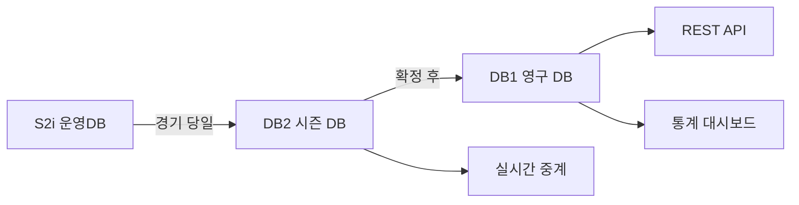

# 경기 요약 (Game Summary)

> 데이터 프로덕트 | 버전: 1 | 최종수정: 2026-02-25

## 개요

단일 경기의 전체 결과를 하나의 단위로 제공한다.
라인 스코어, 주요 선수 기록, 경기 메타데이터를 포함.

## 포함 테이블

| 테이블 | 역할 | 티어 |
|--------|------|------|
| [GAMEINFO](../game/GAMEINFO.md) | 경기 기본 정보 (일시/구장/심판/날씨) | Tier 1 |
| [Hitter](../game/Hitter.md) | 경기별 타자 기록 | Tier 1 |
| [Pitcher](../game/Pitcher.md) | 경기별 투수 기록 | Tier 1 |
| [Score](../game/Score.md) | 이닝별 스코어 | Tier 1 |
| [ENTRY](../game/ENTRY.md) | 출전 라인업 | Tier 1 |
| [GAMECONTAPP](../game/GAMECONTAPP.md) | 타석별 플레이 상세 | Tier 1 |
| [DEFEN](../game/DEFEN.md) | 수비 기록 | Tier 2 |
| [GAME_HR](../game/GAME_HR.md) | 홈런 상세 | Tier 2 |

## 조인 관계

```
GAMEINFO (GMKEY/game_id)
  ├─ Hitter       ON GMKEY, GDAY
  ├─ Pitcher      ON GMKEY, GDAY
  ├─ Score        ON GMKEY, GDAY
  ├─ ENTRY        ON GMKEY, GDAY
  ├─ GAMECONTAPP  ON GMKEY, GYEAR
  ├─ DEFEN        ON GMKEY, GDAY
  └─ GAME_HR      ON G_ID
```

## 소비자

| 소비자 | 용도 |
|--------|------|
| 방송팀 | 중계 화면 데이터 제공 |
| 기록팀 | 공식 기록 확정 |
| 통계팀 | 시즌 집계 입력 데이터 |
| 외부 API | 경기 결과 제공 |

## 품질 SLA

| 지표 | 목표 |
|------|------|
| 완결성 | 경기 종료 후 30분 내 GAMEINFO·Score 수신 |
| 확정 시한 | 익일 17:00 전 CONFIRMED 상태 전환 |
| 오류율 | < 0.1% (FK 불일치 + NULL PK) |

## 데이터 흐름



## 관련 표준

- → 참고: [ID 체계](../../standards/id-system.md) — game_id, player_id 정의
- → 참고: [코드 사전](../../standards/code-dictionary.md) — how_cd, place_cd 등 이벤트 코드
- → 참고: [도메인 타입](../../standards/domain-types.md) — 컬럼 타입 표준
