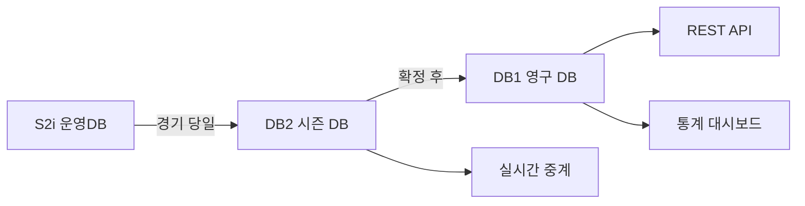

---
hide:
  - toc
---

  

    데이터 프로덕트
    v1
    경기 기록
    경기 당일
  

  
경기 요약

  
Game Summary

  
단일 경기의 전체 결과를 하나의 단위로 제공한다. 라인 스코어, 주요 선수 기록, 경기 메타데이터를 포함.

  

8

테이블

  

216

컬럼

  

경기 당일

갱신 주기

  

Tier 1~2

데이터 티어

<!-- ── 포함 테이블 ── -->

  

    <h2>포함 테이블</h2>
    8개
  

  <table class="product-table">
    <thead><tr><th>테이블</th><th>역할</th><th>티어</th></tr></thead>
    <tbody>
      <tr><td><a href="../game/GAMEINFO/">GAMEINFO</a></td><td>경기 기본 정보 (일시·구장·심판·날씨)</td><td>T1</td></tr>
      <tr><td><a href="../game/Hitter/">Hitter</a></td><td>경기별 타자 기록</td><td>T1</td></tr>
      <tr><td><a href="../game/Pitcher/">Pitcher</a></td><td>경기별 투수 기록</td><td>T1</td></tr>
      <tr><td><a href="../game/Score/">Score</a></td><td>이닝별 스코어</td><td>T1</td></tr>
      <tr><td><a href="../game/ENTRY/">ENTRY</a></td><td>출전 라인업</td><td>T1</td></tr>
      <tr><td><a href="../game/GAMECONTAPP/">GAMECONTAPP</a></td><td>타석별 플레이 상세</td><td>T1</td></tr>
      <tr><td><a href="../game/DEFEN/">DEFEN</a></td><td>수비 기록</td><td>T2</td></tr>
      <tr><td><a href="../game/GAME_HR/">GAME_HR</a></td><td>홈런 상세</td><td>T2</td></tr>
    </tbody>
  </table>

<!-- ── 조인 관계 ── -->

  
<h2>조인 관계</h2>

  
GAMEINFO (GMKEY / game_id)
  ├─ Hitter       ON GMKEY, GDAY
  ├─ Pitcher      ON GMKEY, GDAY
  ├─ Score        ON GMKEY, GDAY
  ├─ ENTRY        ON GMKEY, GDAY
  ├─ GAMECONTAPP  ON GMKEY, GYEAR
  ├─ DEFEN        ON GMKEY, GDAY
  └─ GAME_HR      ON G_ID

<!-- ── 소비자 ── -->

  

    <h2>소비자</h2>
    4개
  

  

    

      
📺

      
방송팀

      
중계 화면 데이터 제공

    

    

      
📋

      
기록팀

      
공식 기록 확정

    

    

      
📊

      
통계팀

      
시즌 집계 입력 데이터

    

    

      
🔗

      
외부 API

      
경기 결과 제공

    

  

<!-- ── 품질 SLA ── -->

  
<h2>품질 SLA</h2>

  

    

      
완결성

      
경기 종료 후 30분 내 GAMEINFO·Score 수신

    

    

      
확정 시한

      
익일 17:00 전 CONFIRMED 상태 전환

    

    

      
오류율

      
&lt; 0.1% FK 불일치 + NULL PK

    

  

<!-- ── 데이터 흐름 ── -->

  
<h2>데이터 흐름</h2>

  

  

<!-- ── 관련 표준 ── -->

  
<h2>관련 표준</h2>

  

    <a class="product-ref" href="../../standards/id-system/">
      
🔑

      

        
ID 체계

        
game_id, player_id 정의

      

    </a>
    <a class="product-ref" href="../../standards/code-dictionary/">
      
📖

      

        
코드 사전

        
how_cd, place_cd 등 이벤트 코드

      

    </a>
    <a class="product-ref" href="../../standards/domain-types/">
      
📐

      

        
도메인 타입

        
컬럼 타입 표준

      

    </a>
  

