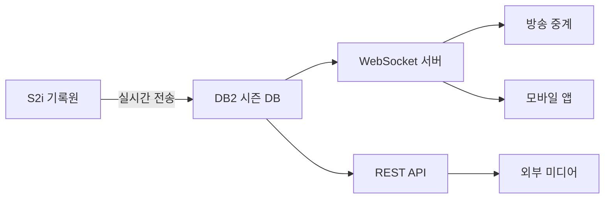

---
hide:
  - toc
---

  

    데이터 프로덕트
    v1
    실시간
    실시간 (&lt;5초)
  

  
실시간 경기

  
Live Game

  
진행 중인 경기의 실시간 상태를 소비자에게 전달한다. WebSocket/API를 통해 실시간 스코어, 볼카운트, 선수 기록을 제공.

  

7

테이블

  

82

컬럼

  

&lt; 5초

지연 시간

  

Tier 1~2

데이터 티어

<!-- ── 포함 테이블 ── -->

  

    <h2>포함 테이블</h2>
    7개
  

  <table class="product-table">
    <thead><tr><th>테이블</th><th>역할</th><th>티어</th></tr></thead>
    <tbody>
      <tr><td><a href="../realtime/IE_LiveText/">IE_LiveText</a></td><td>실시간 문자 중계</td><td>T1</td></tr>
      <tr><td><a href="../realtime/IE_BallCount/">IE_BallCount</a></td><td>현재 볼카운트 상태</td><td>T1</td></tr>
      <tr><td><a href="../realtime/IE_GAMESTATE/">IE_GAMESTATE</a></td><td>경기 진행 상태</td><td>T1</td></tr>
      <tr><td><a href="../realtime/IE_ScoreRHEB/">IE_ScoreRHEB</a></td><td>점수/안타/실책/볼넷 요약</td><td>T1</td></tr>
      <tr><td><a href="../realtime/IE_Scoreinning/">IE_Scoreinning</a></td><td>이닝별 실시간 점수</td><td>T1</td></tr>
      <tr><td><a href="../realtime/IE_BatterRecord/">IE_BatterRecord</a></td><td>타자 실시간 누적 기록</td><td>T2</td></tr>
      <tr><td><a href="../realtime/IE_PitcherRecord/">IE_PitcherRecord</a></td><td>투수 실시간 누적 기록</td><td>T2</td></tr>
    </tbody>
  </table>

<!-- ── 조인 관계 ── -->

  
<h2>조인 관계</h2>

  
IE_GameList (gameID, GYEAR)
  ├─ IE_LiveText       ON gameID, GYEAR
  ├─ IE_BallCount      ON gameID, GYEAR
  ├─ IE_GAMESTATE      ON gameID, GYEAR
  ├─ IE_ScoreRHEB      ON gameID, GYEAR
  ├─ IE_Scoreinning    ON gameID, GYEAR
  ├─ IE_BatterRecord   ON gameID, GYEAR
  └─ IE_PitcherRecord  ON gameID, GYEAR

<!-- ── 소비자 ── -->

  

    <h2>소비자</h2>
    4개
  

  

    

      
📺

      
방송팀

      
중계 화면 실시간 데이터

    

    

      
📱

      
앱 서비스

      
팬 실시간 스코어 조회

    

    

      
⚡

      
WebSocket 클라이언트

      
실시간 이벤트 스트림 소비

    

    

      
📰

      
외부 미디어

      
속보·문자 중계

    

  

<!-- ── 품질 SLA ── -->

  
<h2>품질 SLA</h2>

  

    

      
지연 시간

      
&lt; 5초 S2i 전송 → DB2 저장

    

    

      
가용성

      
99.9% 경기 중 지속 가용

    

    

      
완결성

      
100% 모든 타석 이벤트 누락 없음

    

  

<!-- ── 데이터 흐름 ── -->

  
<h2>데이터 흐름</h2>

  

  

<!-- ── 관련 표준 ── -->

  
<h2>관련 표준</h2>

  

    <a class="product-ref" href="../../standards/id-system/">
      
🔑

      

        
ID 체계

        
game_id, player_id 정의

      

    </a>
    <a class="product-ref" href="../../standards/code-dictionary/">
      
📖

      

        
코드 사전

        
how_cd, place_cd 등 이벤트 코드

      

    </a>
  

