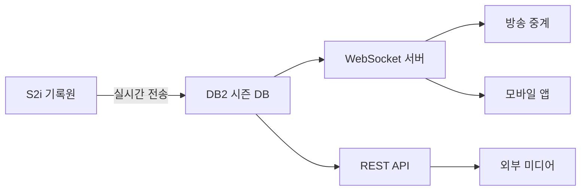

# 실시간 경기 (Live Game)

> 데이터 프로덕트 | 버전: 1 | 최종수정: 2026-02-25

## 개요

진행 중인 경기의 실시간 상태를 소비자에게 전달한다.
WebSocket/API를 통해 실시간 스코어, 볼카운트, 선수 기록을 제공.

## 포함 테이블

| 테이블 | 역할 | 티어 |
|--------|------|------|
| [IE_LiveText](../realtime/IE_LiveText.md) | 실시간 문자 중계 | Tier 1 |
| [IE_BallCount](../realtime/IE_BallCount.md) | 현재 볼카운트 상태 | Tier 1 |
| [IE_GAMESTATE](../realtime/IE_GAMESTATE.md) | 경기 진행 상태 | Tier 1 |
| [IE_ScoreRHEB](../realtime/IE_ScoreRHEB.md) | 점수/안타/실책/볼넷 요약 | Tier 1 |
| [IE_Scoreinning](../realtime/IE_Scoreinning.md) | 이닝별 실시간 점수 | Tier 1 |
| [IE_BatterRecord](../realtime/IE_BatterRecord.md) | 타자 실시간 누적 기록 | Tier 2 |
| [IE_PitcherRecord](../realtime/IE_PitcherRecord.md) | 투수 실시간 누적 기록 | Tier 2 |

## 조인 관계

```
IE_GameList (gameID, GYEAR)
  ├─ IE_LiveText       ON gameID, GYEAR
  ├─ IE_BallCount      ON gameID, GYEAR
  ├─ IE_GAMESTATE      ON gameID, GYEAR
  ├─ IE_ScoreRHEB      ON gameID, GYEAR
  ├─ IE_Scoreinning    ON gameID, GYEAR
  ├─ IE_BatterRecord   ON gameID, GYEAR
  └─ IE_PitcherRecord  ON gameID, GYEAR
```

## 소비자

| 소비자 | 용도 |
|--------|------|
| 방송팀 | 중계 화면 실시간 데이터 |
| 앱 서비스 | 팬 실시간 스코어 조회 |
| WebSocket 클라이언트 | 실시간 이벤트 스트림 소비 |
| 외부 미디어 | 속보/문자 중계 |

## 품질 SLA

| 지표 | 목표 |
|------|------|
| 지연 시간 | < 5초 (S2i 전송 → DB2 저장) |
| 가용성 | 경기 중 99.9% |
| 완결성 | 모든 타석 이벤트 누락 없음 |

## 데이터 흐름



## 관련 표준

- → 참고: [ID 체계](../../standards/id-system.md) — game_id, player_id 정의
- → 참고: [코드 사전](../../standards/code-dictionary.md) — how_cd, place_cd 등 이벤트 코드
