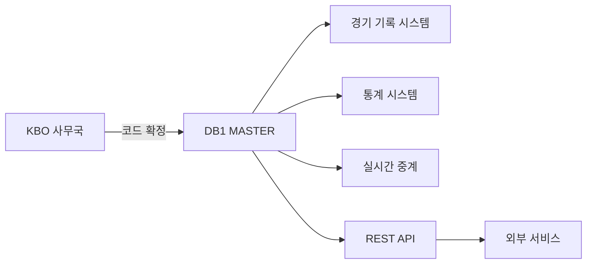

# 기준 데이터 (Master Codes)

> 데이터 프로덕트 | 버전: 1 | 최종수정: 2026-02-25

## 개요

전 시스템에서 참조하는 기준 마스터 데이터를 제공한다.
팀 코드, 구장 코드 등 변경 빈도가 낮은 참조 데이터.

## 포함 테이블

| 테이블 | 역할 | 티어 |
|--------|------|------|
| [TEAM](../master/TEAM.md) | 팀 마스터 (연도별 팀명 이력) | Tier 3 |
| [STADIUM](../master/STADIUM.md) | 구장 마스터 (연도별 구장명) | Tier 3 |

## 조인 관계

```
TEAM (SEASON_ID, T_ID)
  └─ 전 시스템에서 FK 참조

STADIUM (gyear, stadium)
  └─ 전 시스템에서 FK 참조
```

## 소비자

| 소비자 | 용도 |
|--------|------|
| 전 시스템 | FK 참조 (팀/구장 코드) |
| 운영팀 | 구단/구장 관리 |
| 외부 API | 코드 조회 서비스 |

## 품질 SLA

| 지표 | 목표 |
|------|------|
| 갱신 주기 | 연 1회 (시즌 전 갱신) |
| 변경 반영 | 구단명 변경, 신규 구장 등 확정 즉시 |
| 무결성 | 코드 삭제 금지 (이력 보존) |

## 데이터 흐름



## 관련 표준

- → 참고: [ID 체계](../../standards/id-system.md) — team_id, stadium_id 정의
- → 참고: [코드 사전](../../standards/code-dictionary.md) — 팀 코드, 구장 코드

## 참고사항

팀 코드(OB, SK 등)는 구단명 변경에도 불변이다.
이력 관리는 TEAM 테이블의 연도별 팀명으로 처리한다.
