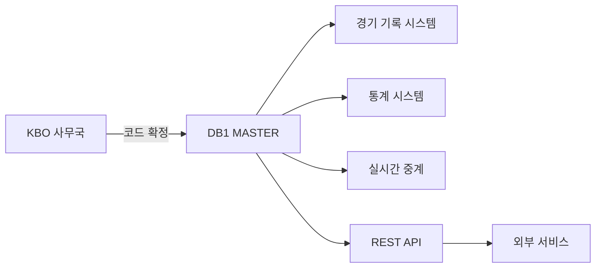

---
hide:
  - toc
---

  

    데이터 프로덕트
    v1
    마스터
    연 1회
  

  
기준 데이터

  
Master Codes

  
전 시스템에서 참조하는 기준 마스터 데이터를 제공한다. 팀 코드, 구장 코드 등 변경 빈도가 낮은 참조 데이터.

  

2

테이블

  

10

컬럼

  

연 1회

갱신 주기

  

Tier 3

데이터 티어

  
팀 코드(OB, SK 등)는 구단명 변경에도 <strong>불변</strong>이다. 이력 관리는 TEAM 테이블의 연도별 팀명으로 처리한다.

<!-- ── 포함 테이블 ── -->

  

    <h2>포함 테이블</h2>
    2개
  

  <table class="product-table">
    <thead><tr><th>테이블</th><th>역할</th><th>티어</th></tr></thead>
    <tbody>
      <tr><td><a href="../master/TEAM/">TEAM</a></td><td>팀 마스터 (연도별 팀명 이력)</td><td>T3</td></tr>
      <tr><td><a href="../master/STADIUM/">STADIUM</a></td><td>구장 마스터 (연도별 구장명)</td><td>T3</td></tr>
    </tbody>
  </table>

<!-- ── 조인 관계 ── -->

  
<h2>조인 관계</h2>

  
TEAM (SEASON_ID, T_ID)
  └─ 전 시스템에서 FK 참조

STADIUM (gyear, stadium)
  └─ 전 시스템에서 FK 참조

<!-- ── 소비자 ── -->

  

    <h2>소비자</h2>
    3개
  

  

    

      
🔗

      
전 시스템

      
FK 참조 (팀·구장 코드)

    

    

      
⚙️

      
운영팀

      
구단·구장 관리

    

    

      
🌐

      
외부 API

      
코드 조회 서비스

    

  

<!-- ── 품질 SLA ── -->

  
<h2>품질 SLA</h2>

  

    

      
갱신 주기

      
연 1회 시즌 전 갱신

    

    

      
변경 반영

      
구단명 변경·신규 구장 등 확정 즉시

    

    

      
무결성

      
코드 삭제 금지 이력 보존 원칙

    

  

<!-- ── 데이터 흐름 ── -->

  
<h2>데이터 흐름</h2>

  

  

<!-- ── 관련 표준 ── -->

  
<h2>관련 표준</h2>

  

    <a class="product-ref" href="../../standards/id-system/">
      
🔑

      

        
ID 체계

        
team_id, stadium_id 정의

      

    </a>
    <a class="product-ref" href="../../standards/code-dictionary/">
      
📖

      

        
코드 사전

        
팀 코드, 구장 코드

      

    </a>
  

