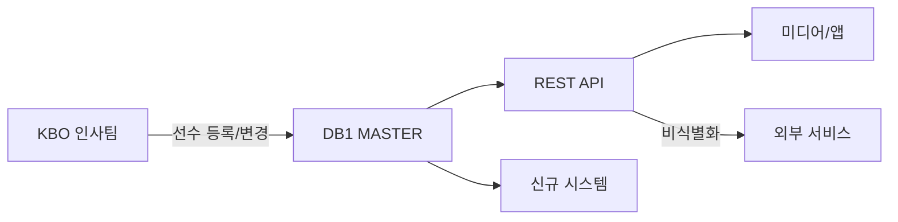

---
hide:
  - toc
---

  

    데이터 프로덕트
    v1
    마스터
    시즌 전
  

  
선수 프로필

  
Player Profile

  
선수의 기본 인적 사항, 경력, 계약 정보를 통합 제공한다. 시즌 개시 전 갱신되며, 시즌 중 이적/FA 발생 시 수시 갱신.

  

4

테이블

  

57

컬럼

  

시즌 전

갱신 주기

  

Tier 1~3

데이터 티어

  
<strong>Restricted 등급</strong> - person 테이블은 PII(개인식별정보)를 포함한다. 외부 제공 시 생년월일, 연봉 등 민감 필드의 비식별화가 필수이다.

<!-- ── 포함 테이블 ── -->

  

    <h2>포함 테이블</h2>
    4개
  

  <table class="product-table">
    <thead><tr><th>테이블</th><th>역할</th><th>티어</th></tr></thead>
    <tbody>
      <tr><td><a href="../master/person/">person</a></td><td>선수 마스터 (이름·생년·포지션·경력)</td><td>T1</td></tr>
      <tr><td><a href="../master/person2/">person2</a></td><td>선수 보조 정보</td><td>T3</td></tr>
      <tr><td><a href="../master/PERSON/">PERSON</a></td><td>선수 마스터 (마이너)</td><td>T3</td></tr>
      <tr><td><a href="../master/PERSON_FA/">PERSON_FA</a></td><td>FA 선수 정보</td><td>T3</td></tr>
    </tbody>
  </table>

<!-- ── 조인 관계 ── -->

  
<h2>조인 관계</h2>

  
person (GYEAR, PCODE)
  ├─ person2     ON GYEAR, PCODE
  ├─ PERSON      ON PCODE (마이너 연계)
  └─ PERSON_FA   (FK 없음, PCODE 기반 수동 매핑)

<!-- ── 소비자 ── -->

  

    <h2>소비자</h2>
    4개
  

  

    

      
📋

      
기록팀

      
선수 등록·말소 관리

    

    

      
👔

      
인사팀

      
계약 관리

    

    

      
📰

      
미디어

      
선수 프로필 카드

    

    

      
🔗

      
외부 API

      
선수 조회 서비스

    

  

<!-- ── 품질 SLA ── -->

  
<h2>품질 SLA</h2>

  

    

      
갱신 시점

      
시즌 개시 전 전체 갱신

    

    

      
수시 갱신

      
이적·FA·신인 드래프트 후 1영업일 내

    

    

      
PII 보호

      
생년월일, 연봉 → Restricted 등급

    

  

<!-- ── 데이터 흐름 ── -->

  
<h2>데이터 흐름</h2>

  

  

<!-- ── 관련 표준 ── -->

  
<h2>관련 표준</h2>

  

    <a class="product-ref" href="../../standards/id-system/">
      
🔑

      

        
ID 체계

        
player_id (PCODE → P_ID 전환) 정의

      

    </a>
    <a class="product-ref" href="../../standards/domain-types/">
      
📐

      

        
도메인 타입

        
날짜·문자열 타입 표준

      

    </a>
    <a class="product-ref" href="../../governance/data-security/">
      
🔒

      

        
데이터 보안

        
PII 등급 분류 및 비식별화 정책

      

    </a>
  

