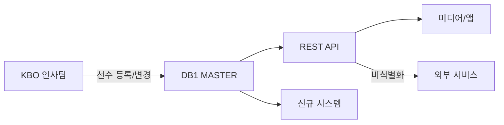

# 선수 프로필 (Player Profile)

> 데이터 프로덕트 | 버전: 1 | 최종수정: 2026-02-25

## 개요

선수의 기본 인적 사항, 경력, 계약 정보를 통합 제공한다.
시즌 개시 전 갱신되며, 시즌 중 이적/FA 발생 시 수시 갱신.

## 포함 테이블

| 테이블 | 역할 | 티어 |
|--------|------|------|
| [person](../master/person.md) | 선수 마스터 (이름/생년/포지션/경력) | Tier 1 |
| [person2](../master/person2.md) | 선수 보조 정보 | Tier 3 |
| [PERSON](../master/PERSON.md) | 선수 마스터 (마이너) | Tier 3 |
| [PERSON_FA](../master/PERSON_FA.md) | FA 선수 정보 | Tier 3 |

## 조인 관계

```
person (GYEAR, PCODE)
  ├─ person2     ON GYEAR, PCODE
  ├─ PERSON      ON PCODE (마이너 연계)
  └─ PERSON_FA   (FK 없음, PCODE 기반 수동 매핑)
```

## 소비자

| 소비자 | 용도 |
|--------|------|
| 기록팀 | 선수 등록/말소 관리 |
| 인사팀 | 계약 관리 |
| 미디어 | 선수 프로필 카드 |
| 외부 API | 선수 조회 서비스 |

## 품질 SLA

| 지표 | 목표 |
|------|------|
| 갱신 시점 | 시즌 개시 전 전체 갱신 |
| 수시 갱신 | 이적/FA/신인 드래프트 후 1영업일 내 |
| PII 보호 | 생년월일, 연봉 → Restricted 등급 |

## 데이터 흐름



## 관련 표준

- → 참고: [ID 체계](../../standards/id-system.md) — player_id (PCODE → P_ID 전환) 정의
- → 참고: [도메인 타입](../../standards/domain-types.md) — 날짜/문자열 타입 표준

## 보안 참고

person 테이블은 PII(개인식별정보)를 포함한다 → **Restricted** 등급.
외부 제공 시 생년월일, 연봉 등 민감 필드의 비식별화가 필수이다.
