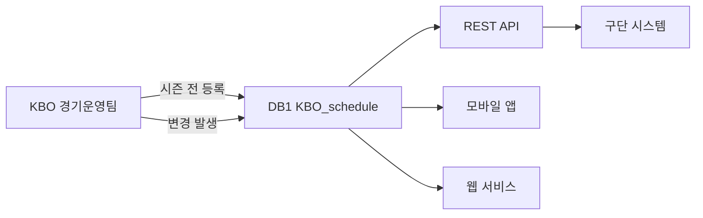

---
hide:
  - toc
---

  

    데이터 프로덕트
    v1
    마스터
    시즌 전 일괄
  

  
일정 관리

  
Schedule

  
시즌 경기 일정, 취소/우천 중단 경기, 기상 정보를 관리한다. 시즌 전 일괄 등록 후 변경 시 즉시 갱신.

  

3

테이블

  

40

컬럼

  

시즌 전

초기 등록

  

Tier 2~3

데이터 티어

<!-- ── 포함 테이블 ── -->

  

    <h2>포함 테이블</h2>
    3개
  

  <table class="product-table">
    <thead><tr><th>테이블</th><th>역할</th><th>티어</th></tr></thead>
    <tbody>
      <tr><td><a href="../master/KBO_schedule/">KBO_schedule</a></td><td>경기 일정 (시즌 전체)</td><td>T2</td></tr>
      <tr><td><a href="../master/CANCEL_GAME/">CANCEL_GAME</a></td><td>취소·우천 중단 경기</td><td>T2</td></tr>
      <tr><td><a href="../game/GAMEINFO_WEATHER/">GAMEINFO_WEATHER</a></td><td>기상청 상세 날씨</td><td>T3</td></tr>
    </tbody>
  </table>

<!-- ── 조인 관계 ── -->

  
<h2>조인 관계</h2>

  
KBO_schedule (gmkey, gamedate)
  ├─ CANCEL_GAME        ON G_ID
  └─ GAMEINFO_WEATHER   ON code (구장 코드 기반)

<!-- ── 소비자 ── -->

  

    <h2>소비자</h2>
    4개
  

  

    

      
⚙️

      
운영팀

      
일정 관리 및 변경 처리

    

    

      
📺

      
방송팀

      
중계 편성

    

    

      
📱

      
팬 서비스

      
일정 조회 앱·웹

    

    

      
🏟️

      
구단

      
원정 일정 확인

    

  

<!-- ── 품질 SLA ── -->

  
<h2>품질 SLA</h2>

  

    

      
초기 등록

      
시즌 전 일괄 등록

    

    

      
변경 반영

      
우천 취소 등 발생 시 1시간 내

    

    

      
정확성

      
일정 오류율 0% 공식 발표 대비

    

  

<!-- ── 데이터 흐름 ── -->

  
<h2>데이터 흐름</h2>

  

  

<!-- ── 관련 표준 ── -->

  
<h2>관련 표준</h2>

  

    <a class="product-ref" href="../../standards/id-system/">
      
🔑

      

        
ID 체계

        
game_id, series_id 정의

      

    </a>
    <a class="product-ref" href="../../standards/code-dictionary/">
      
📖

      

        
코드 사전

        
series_id (시리즈 구분 코드)

      

    </a>
  

