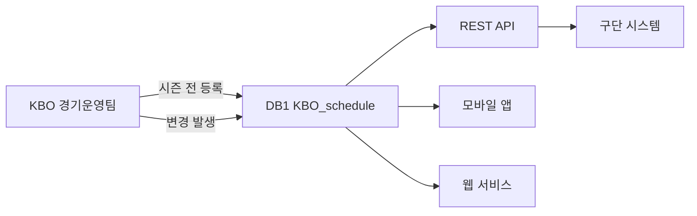

# 일정 관리 (Schedule)

> 데이터 프로덕트 | 버전: 1 | 최종수정: 2026-02-25

## 개요

시즌 경기 일정, 취소/우천 중단 경기, 기상 정보를 관리한다.
시즌 전 일괄 등록 후 변경 시 즉시 갱신.

## 포함 테이블

| 테이블 | 역할 | 티어 |
|--------|------|------|
| [KBO_schedule](../master/KBO_schedule.md) | 경기 일정 (시즌 전체) | Tier 2 |
| [CANCEL_GAME](../master/CANCEL_GAME.md) | 취소/우천 중단 경기 | Tier 2 |
| [GAMEINFO_WEATHER](../game/GAMEINFO_WEATHER.md) | 기상청 상세 날씨 | Tier 3 |

## 조인 관계

```
KBO_schedule (gmkey, gamedate)
  ├─ CANCEL_GAME        ON G_ID
  └─ GAMEINFO_WEATHER   ON code (구장 코드 기반)
```

## 소비자

| 소비자 | 용도 |
|--------|------|
| 운영팀 | 일정 관리 및 변경 처리 |
| 방송팀 | 중계 편성 |
| 팬 서비스 | 일정 조회 앱/웹 |
| 구단 | 원정 일정 확인 |

## 품질 SLA

| 지표 | 목표 |
|------|------|
| 초기 등록 | 시즌 전 일괄 등록 |
| 변경 반영 | 우천 취소 등 발생 시 즉시 (1시간 내) |
| 정확성 | 일정 오류율 0% (공식 발표 대비) |

## 데이터 흐름



## 관련 표준

- → 참고: [ID 체계](../../standards/id-system.md) — game_id, series_id 정의
- → 참고: [코드 사전](../../standards/code-dictionary.md) — series_id (시리즈 구분 코드)
