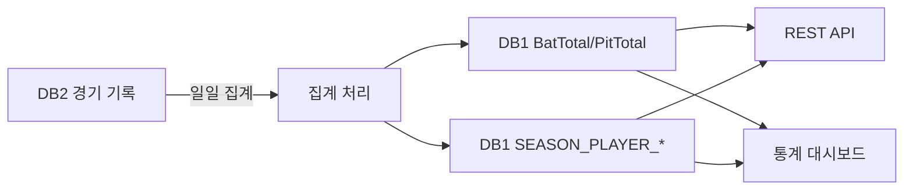

---
hide:
  - toc
---

  

    데이터 프로덕트
    v1
    통계
    D+1
  

  
시즌 통계

  
Season Stats

  
시즌 중·후 집계되는 선수/팀 통계를 제공한다. 타격·투구 합산, 팀 순위, 상황별 통계 포함.

  

10

테이블

  

318

컬럼

  

D+1

갱신 주기

  

Tier 2~3

데이터 티어

  
<strong>GYEAR=9999</strong>는 통산 기록행이다. 시즌별 조회 시 반드시 제외해야 한다. 
  <strong>PCODE='T'</strong> 또는 <strong>PCODE='B'</strong>는 팀 합계행이다. 개인 통계 조회 시 제외 필요.

<!-- ── 포함 테이블 ── -->

  

    <h2>포함 테이블</h2>
    10개
  

  <table class="product-table">
    <thead><tr><th>테이블</th><th>역할</th><th>티어</th></tr></thead>
    <tbody>
      <tr><td><a href="../stats/BatTotal/">BatTotal</a></td><td>타격 시즌/통산 합산</td><td>T2</td></tr>
      <tr><td><a href="../stats/PitTotal/">PitTotal</a></td><td>투구 시즌/통산 합산</td><td>T2</td></tr>
      <tr><td><a href="../stats/TeamRank/">TeamRank</a></td><td>팀 순위 (시즌별)</td><td>T2</td></tr>
      <tr><td><a href="../stats/KBO_BATRESULT/">KBO_BATRESULT</a></td><td>이닝별 타격 결과 (90컬럼)</td><td>T2</td></tr>
      <tr><td><a href="../stats/KBO_PITRESULT/">KBO_PITRESULT</a></td><td>투수 경기 결과 상세</td><td>T2</td></tr>
      <tr><td><a href="../stats/KBO_ETCGAME/">KBO_ETCGAME</a></td><td>기타 경기 이벤트</td><td>T3</td></tr>
      <tr><td><a href="../stats/SEASON_PLAYER_HITTER/">SEASON_PLAYER_HITTER</a></td><td>시즌별 타자 통계</td><td>T2</td></tr>
      <tr><td><a href="../stats/SEASON_PLAYER_HITTER_SITUATION/">SEASON_PLAYER_HITTER_SITUATION</a></td><td>타자 상황별 통계</td><td>T2</td></tr>
      <tr><td><a href="../stats/SEASON_PLAYER_PITCHER/">SEASON_PLAYER_PITCHER</a></td><td>시즌별 투수 통계</td><td>T2</td></tr>
      <tr><td><a href="../stats/SEASON_PLAYER_PITCHER_SITUATION/">SEASON_PLAYER_PITCHER_SITUATION</a></td><td>투수 상황별 통계</td><td>T2</td></tr>
    </tbody>
  </table>

<!-- ── 조인 관계 ── -->

  
<h2>조인 관계</h2>

  
BatTotal / PitTotal (PCODE, GYEAR)
  ├─ BatTotal              ON PCODE, GYEAR
  ├─ PitTotal              ON PCODE, GYEAR
  └─ TeamRank              ON GYEAR, TEAM

SEASON_PLAYER_* (SEASON_ID, P_ID)
  ├─ SEASON_PLAYER_HITTER              ON SEASON_ID, P_ID
  ├─ SEASON_PLAYER_HITTER_SITUATION    ON SEASON_ID, P_ID
  ├─ SEASON_PLAYER_PITCHER             ON SEASON_ID, P_ID
  └─ SEASON_PLAYER_PITCHER_SITUATION   ON SEASON_ID, P_ID

KBO_BATRESULT / KBO_PITRESULT (GMKEY, PCODE)
  ├─ KBO_BATRESULT         ON GMKEY, PCODE
  ├─ KBO_PITRESULT         ON GMKEY, PCODE
  └─ KBO_ETCGAME           ON GMKEY

<!-- ── 소비자 ── -->

  

    <h2>소비자</h2>
    4개
  

  

    

      
📊

      
통계팀

      
리더보드·순위 산출

    

    

      
📰

      
미디어

      
기록 기사 작성

    

    

      
🔗

      
외부 API

      
통계 조회 서비스

    

    

      
🔬

      
분석팀

      
세이버메트릭스 분석

    

  

<!-- ── 품질 SLA ── -->

  
<h2>품질 SLA</h2>

  

    

      
일일 갱신

      
시즌 중 D+1 전일 경기 결과 반영

    

    

      
시즌 확정

      
시즌 종료 후 30일 내 최종 확정

    

    

      
통산 기록

      
GYEAR=9999 행 연 1회 갱신

    

  

<!-- ── 데이터 흐름 ── -->

  
<h2>데이터 흐름</h2>

  

  

<!-- ── 관련 표준 ── -->

  
<h2>관련 표준</h2>

  

    <a class="product-ref" href="../../standards/id-system/">
      
🔑

      

        
ID 체계

        
player_id, season_id 정의

      

    </a>
    <a class="product-ref" href="../../standards/domain-types/">
      
📐

      

        
도메인 타입

        
비율은 decimal 타입 적용

      

    </a>
    <a class="product-ref" href="../../standards/abbreviations/">
      
📝

      

        
약어 사전

        
타격·투구 통계 약어

      

    </a>
  

