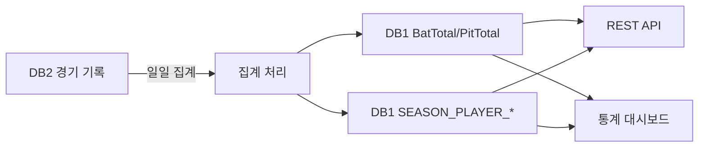

# 시즌 통계 (Season Stats)

> 데이터 프로덕트 | 버전: 1 | 최종수정: 2026-02-25

## 개요

시즌 중·후 집계되는 선수/팀 통계를 제공한다.
타격·투구 합산, 팀 순위, 상황별 통계 포함.

## 포함 테이블

| 테이블 | 역할 | 티어 |
|--------|------|------|
| [BatTotal](../stats/BatTotal.md) | 타격 시즌/통산 합산 | Tier 2 |
| [PitTotal](../stats/PitTotal.md) | 투구 시즌/통산 합산 | Tier 2 |
| [TeamRank](../stats/TeamRank.md) | 팀 순위 (시즌별) | Tier 2 |
| [KBO_BATRESULT](../stats/KBO_BATRESULT.md) | 이닝별 타격 결과 (90컬럼) | Tier 2 |
| [KBO_PITRESULT](../stats/KBO_PITRESULT.md) | 투수 경기 결과 상세 | Tier 2 |
| [KBO_ETCGAME](../stats/KBO_ETCGAME.md) | 기타 경기 이벤트 | Tier 3 |
| [SEASON_PLAYER_HITTER](../stats/SEASON_PLAYER_HITTER.md) | 시즌별 타자 통계 | Tier 2 |
| [SEASON_PLAYER_HITTER_SITUATION](../stats/SEASON_PLAYER_HITTER_SITUATION.md) | 타자 상황별 통계 | Tier 2 |
| [SEASON_PLAYER_PITCHER](../stats/SEASON_PLAYER_PITCHER.md) | 시즌별 투수 통계 | Tier 2 |
| [SEASON_PLAYER_PITCHER_SITUATION](../stats/SEASON_PLAYER_PITCHER_SITUATION.md) | 투수 상황별 통계 | Tier 2 |

## 조인 관계

```
BatTotal / PitTotal (PCODE, GYEAR)
  ├─ BatTotal              ON PCODE, GYEAR
  ├─ PitTotal              ON PCODE, GYEAR
  └─ TeamRank              ON GYEAR, TEAM

SEASON_PLAYER_* (SEASON_ID, P_ID)
  ├─ SEASON_PLAYER_HITTER              ON SEASON_ID, P_ID
  ├─ SEASON_PLAYER_HITTER_SITUATION    ON SEASON_ID, P_ID
  ├─ SEASON_PLAYER_PITCHER             ON SEASON_ID, P_ID
  └─ SEASON_PLAYER_PITCHER_SITUATION   ON SEASON_ID, P_ID

KBO_BATRESULT / KBO_PITRESULT (GMKEY, PCODE)
  ├─ KBO_BATRESULT         ON GMKEY, PCODE
  ├─ KBO_PITRESULT         ON GMKEY, PCODE
  └─ KBO_ETCGAME           ON GMKEY
```

## 소비자

| 소비자 | 용도 |
|--------|------|
| 통계팀 | 리더보드/순위 산출 |
| 미디어 | 기록 기사 작성 |
| 외부 API | 통계 조회 서비스 |
| 분석팀 | 세이버메트릭스 분석 |

## 품질 SLA

| 지표 | 목표 |
|------|------|
| 일일 갱신 | 시즌 중 D+1 (전일 경기 결과 반영) |
| 시즌 확정 | 시즌 종료 후 30일 내 최종 확정 |
| 통산 기록 | GYEAR=9999 행 연 1회 갱신 |

## 데이터 흐름



## 관련 표준

- → 참고: [ID 체계](../../standards/id-system.md) — player_id, season_id 정의
- → 참고: [도메인 타입](../../standards/domain-types.md) — 비율은 decimal 타입 적용
- → 참고: [약어 사전](../../standards/abbreviations.md) — 타격/투구 통계 약어

## 주의사항

- `GYEAR=9999`는 통산 기록행이다. 시즌별 조회 시 반드시 제외해야 한다.
- `PCODE='T'` 또는 `PCODE='B'`는 팀 합계행이다. 개인 통계 조회 시 제외 필요.
